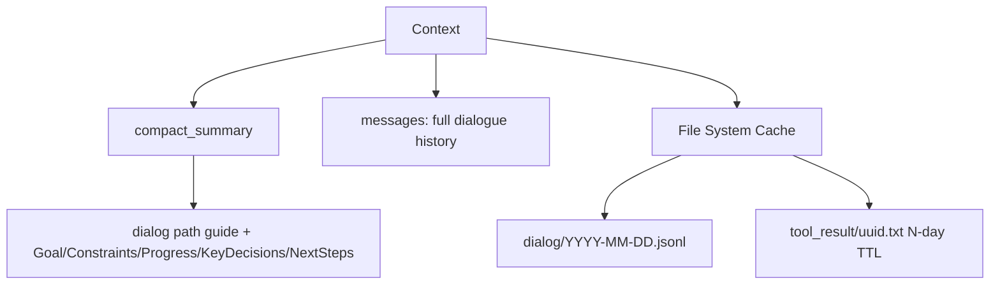
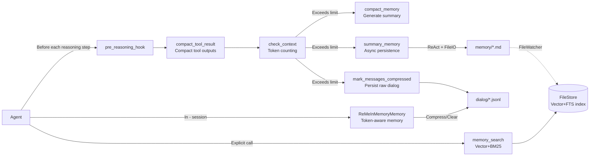
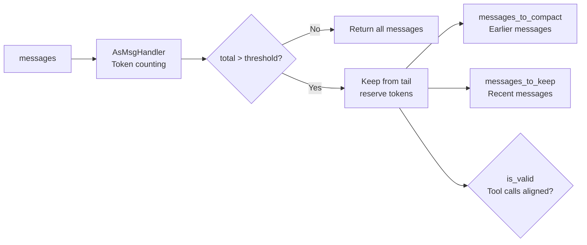
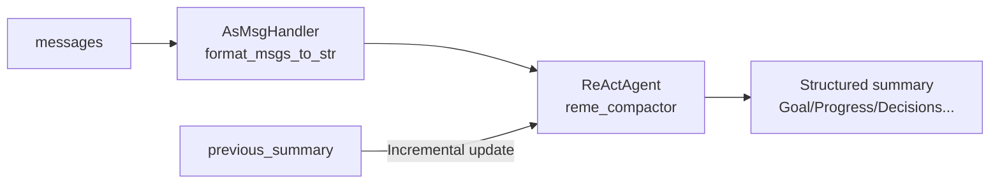
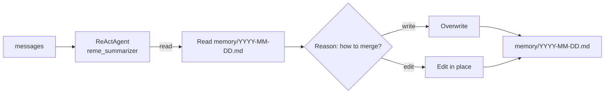
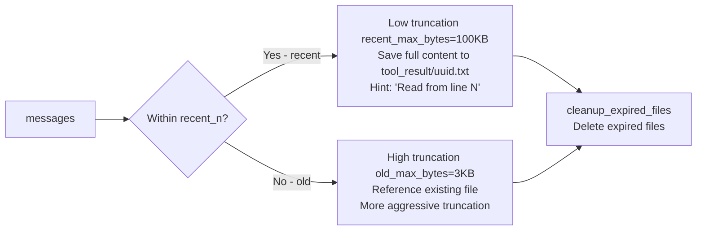
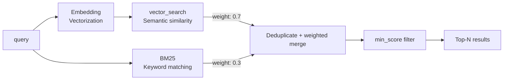
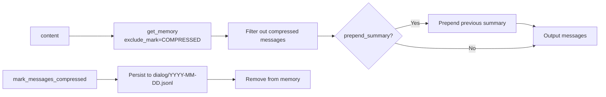
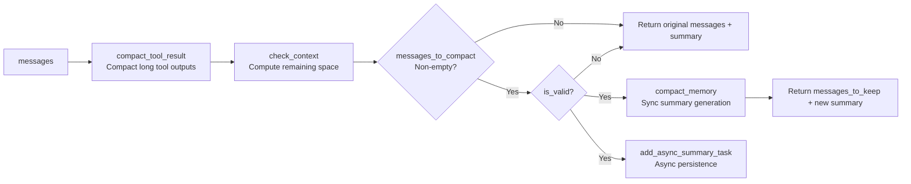
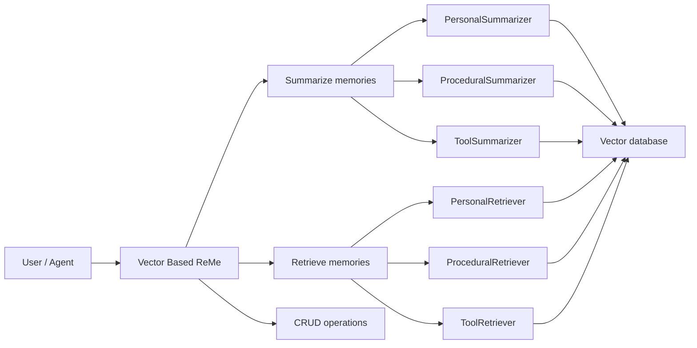

<p align="center">
 
</p>

<p align="center">
  <a href="https://pypi.org/project/reme-ai/"></a>
  <a href="https://pypi.org/project/reme-ai/"></a>
  <a href="https://pepy.tech/project/reme-ai/"></a>
  <a href="https://github.com/agentscope-ai/ReMe"></a>
</p>

<p align="center">
  <a href="./LICENSE"></a>
  <a href="./README.md"></a>
  <a href="./README_ZH.md"></a>
  <a href="https://github.com/agentscope-ai/ReMe"></a>
  <a href="https://deepwiki.com/agentscope-ai/ReMe"></a>
</p>

<p align="center">
<a href="https://trendshift.io/repositories/20528" target="_blank"></a>
</p>

<p align="center">
  <strong>A memory management toolkit for AI agents — Remember Me, Refine Me.</strong><br>
</p>

> For the older version, please refer to the [0.2.x documentation](docs/README_0_2_x.md).

---

## 📰 Latest Articles

| Date       | Title                                                           |
|------------|-----------------------------------------------------------------|
| 2026-03-30 | [Context Management Design](docs/copaw_context_design.md) |

---

🧠 ReMe is a memory management framework designed for **AI agents**, providing
both [file-based](#-file-based-memory-system-remelight) and [vector-based](#-vector-based-memory-system) memory systems.

It tackles two core problems of agent memory: **limited context window** (early information is truncated or lost in long
conversations) and **stateless sessions** (new sessions cannot inherit history and always start from scratch).

ReMe gives agents **real memory** — old conversations are automatically compacted, important information is persistently
stored, and relevant context is automatically recalled in future interactions.

ReMe achieves state-of-the-art results on the LoCoMo and HaluMem benchmarks; see the [Experimental results](#experimental-results).

<details>
<summary><b>What you can do with ReMe</b></summary>

<br>

- **Personal assistant**: Provide long-term memory for agents like [QwenPaw](https://github.com/agentscope-ai/CoPaw),
  remembering user preferences and conversation history.
- **Coding assistant**: Record code style preferences and project context, maintaining a consistent development
  experience across sessions.
- **Customer service bot**: Track user issue history and preference settings for personalized service.
- **Task automation**: Learn success/failure patterns from historical tasks to continuously optimize execution
  strategies.
- **Knowledge Q&A**: Build a searchable knowledge base with semantic search and exact matching support.
- **Multi-turn dialogue**: Automatically compress long conversations while retaining key information within limited
  context windows.

</details>

---

## 📁 File-based memory system (ReMeLight)

> Memory as files, files as memory.

Treat **memory as files** — readable, editable, and copyable.
[QwenPaw](https://github.com/agentscope-ai/CoPaw) integrates long-term memory and context management by inheriting from
`ReMeLight`.

| Traditional memory system | File-based ReMe      |
|---------------------------|----------------------|
| 🗄️ Database storage      | 📝 Markdown files    |
| 🔒 Opaque                 | 👀 Always readable   |
| ❌ Hard to modify          | ✏️ Directly editable |
| 🚫 Hard to migrate        | 📦 Copy to migrate   |

```
working_dir/
├── MEMORY.md              # Long-term memory: persistent info such as user preferences
├── memory/
│   └── YYYY-MM-DD.md      # Daily journal: automatically written after each conversation
├── dialog/                # Raw conversation records: full dialog before compression
│   └── YYYY-MM-DD.jsonl   # Daily conversation messages in JSONL format
└── tool_result/           # Cache for long tool outputs (auto-managed, expired entries auto-cleaned)
    └── <uuid>.txt
```

### Core capabilities

[ReMeLight](reme/reme_light.py) is the core class of the file-based memory system. It provides full memory management
capabilities for AI agents:

<table>
<tr><th>Category</th><th>Method</th><th>Function</th><th>Key components</th></tr>
<tr><td rowspan="4">Context Management</td><td><code>check_context</code></td><td>📊 Check context size</td><td><a href="reme/memory/file_based/components/context_checker.py">ContextChecker</a> — checks whether context exceeds thresholds and splits messages</td></tr>
<tr><td><code>compact_memory</code></td><td>📦 Compact history into summary</td><td><a href="reme/memory/file_based/components/compactor.py">Compactor</a> — ReActAgent that generates structured context summaries</td></tr>
<tr><td><code>compact_tool_result</code></td><td>✂️ Compact long tool outputs</td><td><a href="reme/memory/file_based/components/tool_result_compactor.py">ToolResultCompactor</a> — truncates long tool outputs and stores them in <code>tool_result/</code> while keeping file references in messages</td></tr>
<tr><td><code>pre_reasoning_hook</code></td><td>🔄 Pre-reasoning hook</td><td><code>compact_tool_result</code> + <code>check_context</code> + <code>compact_memory</code> + <code>summary_memory</code> (async)</td></tr>
<tr><td rowspan="2">Long-term Memory</td><td><code>summary_memory</code></td><td>📝 Persist important memory to files</td><td><a href="reme/memory/file_based/components/summarizer.py">Summarizer</a> — ReActAgent + file tools (<code>read</code> / <code>write</code> / <code>edit</code>)</td></tr>
<tr><td><code>memory_search</code></td><td>🔍 Semantic memory search</td><td><a href="reme/memory/file_based/tools/memory_search.py">MemorySearch</a> — hybrid retrieval with vectors + BM25</td></tr>
<tr><td rowspan="2">Session Memory</td><td><code>get_in_memory_memory</code></td><td>💾 Create in-session memory instance</td><td>Returns ReMeInMemoryMemory with dialog_path configured for persistence</td></tr>
<tr><td><code>await_summary_tasks</code></td><td>⏳ Wait for async summary tasks</td><td>Block until all background summary tasks complete</td></tr>
<tr><td>-</td><td><code>start</code></td><td>🚀 Start memory system</td><td>Initialize file storage, file watcher, and embedding cache; clean up expired tool result files</td></tr>
<tr><td>-</td><td><code>close</code></td><td>📕 Shutdown and cleanup</td><td>Clean up tool result files, stop file watcher, and persist embedding cache</td></tr>
</table>

---

### 🚀 Quick start

#### Installation

**Install from source:**

```bash
git clone https://github.com/agentscope-ai/ReMe.git
cd ReMe
pip install -e ".[light]"
```

**Update to the latest version:**

```bash
git pull
pip install -e ".[light]"
```

#### Environment variables

`ReMeLight` uses environment variables to configure the embedding model and storage backends:

| Variable             | Description                   | Example                                             |
|----------------------|-------------------------------|-----------------------------------------------------|
| `LLM_API_KEY`        | LLM API key                   | `sk-xxx`                                            |
| `LLM_BASE_URL`       | LLM base URL                  | `https://dashscope.aliyuncs.com/compatible-mode/v1` |
| `EMBEDDING_API_KEY`  | Embedding API key (optional)  | `sk-xxx`                                            |
| `EMBEDDING_BASE_URL` | Embedding base URL (optional) | `https://dashscope.aliyuncs.com/compatible-mode/v1` |

#### Python usage

```python
import asyncio

from reme.reme_light import ReMeLight


async def main():
    # Initialize ReMeLight
    reme = ReMeLight(
        default_as_llm_config={"model_name": "qwen3.5-35b-a3b"},
        # default_embedding_model_config={"model_name": "text-embedding-v4"},
        default_file_store_config={"fts_enabled": True, "vector_enabled": False},
        enable_load_env=True,
    )
    await reme.start()

    messages = [...]  # List of conversation messages

    # 1. Check context size (token counting, determine if compaction is needed)
    messages_to_compact, messages_to_keep, is_valid = await reme.check_context(
        messages=messages,
        memory_compact_threshold=90000,  # Threshold to trigger compaction (tokens)
        memory_compact_reserve=10000,  # Token count to reserve for recent messages
    )

    # 2. Compact conversation history into a structured summary
    summary = await reme.compact_memory(
        messages=messages,
        previous_summary="",
        max_input_length=128000,  # Model context window (tokens)
        compact_ratio=0.7,  # Trigger compaction when exceeding max_input_length * 0.7
        language="zh",  # Summary language (e.g., "zh" / "")
    )

    # 3. Compact long tool outputs (prevent tool results from blowing up context)
    messages = await reme.compact_tool_result(messages)

    # 4. Pre-reasoning hook (auto compact tool results + check context + generate summaries)
    processed_messages, compressed_summary = await reme.pre_reasoning_hook(
        messages=messages,
        system_prompt="You are a helpful AI assistant.",
        compressed_summary="",
        max_input_length=128000,
        compact_ratio=0.7,
        memory_compact_reserve=10000,
        enable_tool_result_compact=True,
        tool_result_compact_keep_n=3,
    )

    # 5. Persist important memory to files (writes to memory/YYYY-MM-DD.md)
    summary_result = await reme.summary_memory(
        messages=messages,
        language="zh",
    )

    # 6. Semantic memory search (vector + BM25 hybrid retrieval)
    result = await reme.memory_search(query="Python version preference", max_results=5)

    # 7. Create in-session memory instance (manages context for one conversation)
    memory = reme.get_in_memory_memory()  # Auto-configures dialog_path
    for msg in messages:
        await memory.add(msg)
    token_stats = await memory.estimate_tokens(max_input_length=128000)
    print(f"Current context usage: {token_stats['context_usage_ratio']:.1f}%")
    print(f"Message token count: {token_stats['messages_tokens']}")
    print(f"Estimated total tokens: {token_stats['estimated_tokens']}")

    # 8. Mark messages as compressed (auto-persists to dialog/YYYY-MM-DD.jsonl)
    # await memory.mark_messages_compressed(messages_to_compact)

    # Shutdown ReMeLight
    await reme.close()


if __name__ == "__main__":
    asyncio.run(main())
```

> 📂 Full example: [test_reme_light.py](tests/light/test_reme_light.py)
> 📋 Sample run log: [test_reme_light_log.txt](tests/light/test_reme_light_log.txt) (223,838 tokens → 1,105 tokens, 99.5%
> compression)

### Architecture of the file-based ReMeLight memory system

#### Context data structure



---

[MemoryManager](https://github.com/agentscope-ai/CoPaw/blob/main/src/copaw/agents/memory/reme_light_memory_manager.py)
inherits `ReMeLight` and integrates its memory capabilities into the agent reasoning loop:



---

#### 1. `check_context` — context checking

[ContextChecker](reme/memory/file_based/components/context_checker.py) uses token counting to determine whether the
context exceeds thresholds and automatically splits messages into a "to compact" group and a "to keep" group.



- **Core logic**: keep `reserve` tokens from the tail; mark the rest as messages to compact.
- **Integrity guarantee**: preserves complete user-assistant turns and tool_use/tool_result pairs without splitting
  them.

---

#### 2. `compact_memory` — conversation compaction

[Compactor](reme/memory/file_based/components/compactor.py) uses a ReActAgent to compact conversation history into a *
*structured context summary**.



**Summary structure** (context checkpoints):

| Field                 | Description                                                                             |
|-----------------------|-----------------------------------------------------------------------------------------|
| `## Goal`             | User goals                                                                              |
| `## Constraints`      | Constraints and preferences                                                             |
| `## Progress`         | Task progress                                                                           |
| `## Key Decisions`    | Key decisions                                                                           |
| `## Next Steps`       | Next step plans                                                                         |
| `## Critical Context` | Critical data such as file paths, function names, error messages, etc.                  |

- **Incremental updates**: when `previous_summary` is provided, new conversations are merged into the existing summary.
- **Thinking enhancement**: with `add_thinking_block=True` (default), a reasoning step is added before generating the
  summary to improve quality.

---

#### 3. `summary_memory` — persistent memory

[Summarizer](reme/memory/file_based/components/summarizer.py) uses a **ReAct + file tools** pattern so that the AI can
decide what to write and where to write it.



**File tools** ([FileIO](reme/memory/file_based/tools/file_io.py)):

| Tool    | Function              |
|---------|-----------------------|
| `read`  | Read file content     |
| `write` | Overwrite file        |
| `edit`  | Find-and-replace edit |

---

#### 4. `compact_tool_result` — tool result compaction

[ToolResultCompactor](reme/memory/file_based/components/tool_result_compactor.py) addresses the problem of long tool
outputs bloating the context. It applies two different truncation strategies depending on whether a message falls within
the `recent_n` window:



| Parameter          | Default               | Description                                                                                                                   |
|--------------------|-----------------------|-------------------------------------------------------------------------------------------------------------------------------|
| `recent_n`         | `1`                   | Minimum number of trailing consecutive tool-result messages treated as "recent" (use low truncation)                          |
| `recent_max_bytes` | `100 * 1024` (100 KB) | Truncation threshold for recent messages; content beyond this is saved to `tool_result/` with a file path and start-line hint |
| `old_max_bytes`    | `3000` (3 KB)         | Truncation threshold for older messages; truncation is more aggressive                                                        |
| `retention_days`   | `3`                   | Number of days to retain tool result files; expired files are auto-cleaned                                                    |

- **Auto cleanup**: expired files (older than `retention_days`) are deleted automatically during `start` / `close` /
  `compact_tool_result`.

---

#### 5. `memory_search` — memory retrieval

[MemorySearch](reme/memory/file_based/tools/memory_search.py) provides **vector + BM25 hybrid retrieval**.



- **Fusion mechanism**: vector weight 0.7 + BM25 weight 0.3 — balancing semantic similarity and exact matches.

---

#### 6. `ReMeInMemoryMemory` — in-session memory

[ReMeInMemoryMemory](reme/memory/file_based/reme_in_memory_memory.py) extends AgentScope's `InMemoryMemory` to provide
token-aware memory management and raw conversation persistence.



| Function                         | Description                                              |
|----------------------------------|----------------------------------------------------------|
| `get_memory`                     | Filter messages by mark and auto-append summary          |
| `estimate_tokens`                | Estimate token usage of the context                      |
| `state_dict` / `load_state_dict` | Serialize/deserialize state (session persistence)        |
| `mark_messages_compressed`       | Mark messages compressed and persist to dialog directory |
| `clear_content`                  | Persist all messages before clearing memory              |

**Raw conversation persistence**: When messages are compressed or cleared, they are automatically saved to
`{dialog_path}/{date}.jsonl` with one JSON-formatted message per line.

---

#### 7. `pre_reasoning_hook` — pre-reasoning processing

This is a unified entry point that wires all the above components together and automatically manages context before each
reasoning step.



**Execution flow**:

1. `compact_tool_result` — compact long tool outputs for all messages except the most recent
   `tool_result_compact_keep_n`.
2. `check_context` — check whether the context exceeds limits (remaining space = threshold minus tokens used by system
   prompt and compressed summary).
3. `compact_memory` — generate compact summary (sync), appended into `compact_summary`.
4. `summary_memory` — persist memory to `memory/*.md` (async in the background, non-blocking).

| Key parameter                | Default | Description                                                                         |
|------------------------------|---------|-------------------------------------------------------------------------------------|
| `tool_result_compact_keep_n` | `3`     | Skip tool result compaction for the most recent N messages (preserve full content)  |
| `memory_compact_reserve`     | `10000` | Token count to reserve for recent messages; messages beyond this trigger compaction |
| `compact_ratio`              | `0.7`   | Compaction threshold ratio: `max_input_length × compact_ratio × 0.95`               |

---

## 🗃️ Vector-based memory system

[ReMe Vector Based](reme/reme.py) is the core class for the vector-based memory system. It manages three types of
memories:

| Memory type           | Use case                                                          |
|-----------------------|-------------------------------------------------------------------|
| **Personal memory**   | Records user preferences and habits                               |
| **Procedural memory** | Records task execution experience and patterns of success/failure |
| **Tool memory**       | Records tool usage experience and parameter tuning                |

### Core capabilities

| Method             | Function     | Description                                                 |
|--------------------|--------------|-------------------------------------------------------------|
| `summarize_memory` | 🧠 Summarize | Automatically extract and store memories from conversations |
| `retrieve_memory`  | 🔍 Retrieve  | Retrieve related memories based on a query                  |
| `add_memory`       | ➕ Add        | Manually add memories into the vector store                 |
| `get_memory`       | 📖 Get       | Get a single memory by ID                                   |
| `update_memory`    | ✏️ Update    | Update existing memory content or metadata                  |
| `delete_memory`    | 🗑️ Delete   | Delete a specific memory                                    |
| `list_memory`      | 📋 List      | List memories with filtering and sorting                    |

### Installation and environment variables

Installation and environment configuration are the same as [ReMeLight](#installation).
API keys are configured via environment variables and can be stored in a `.env` file at the project root.

### Python usage

```python
import asyncio

from reme import ReMe


async def main():
    # Initialize ReMe
    reme = ReMe(
        working_dir=".reme",
        default_llm_config={
            "backend": "openai",
            "model_name": "qwen3.5-plus",
        },
        default_embedding_model_config={
            "backend": "openai",
            "model_name": "text-embedding-v4",
            "dimensions": 1024,
        },
        default_vector_store_config={
            "backend": "local",  # Supports local/chroma/qdrant/elasticsearch/obvec/hologres
        },
    )
    await reme.start()

    messages = [
        {"role": "user", "content": "Help me write a Python script", "time_created": "2026-02-28 10:00:00"},
        {"role": "assistant", "content": "Sure, I'll help you with that.", "time_created": "2026-02-28 10:00:05"},
    ]

    # 1. Summarize memories from conversation (automatically extract user preferences, task experience, etc.)
    result = await reme.summarize_memory(
        messages=messages,
        user_name="alice",  # Personal memory
        # task_name="code_writing",  # Procedural memory
    )
    print(f"Summary result: {result}")

    # 2. Retrieve related memories
    memories = await reme.retrieve_memory(
        query="Python programming",
        user_name="alice",
        # task_name="code_writing",
    )
    print(f"Retrieved memories: {memories}")

    # 3. Manually add a memory
    memory_node = await reme.add_memory(
        memory_content="The user prefers concise code style.",
        user_name="alice",
    )
    print(f"Added memory: {memory_node}")
    memory_id = memory_node.memory_id

    # 4. Get a single memory by ID
    fetched_memory = await reme.get_memory(memory_id=memory_id)
    print(f"Fetched memory: {fetched_memory}")

    # 5. Update memory content
    updated_memory = await reme.update_memory(
        memory_id=memory_id,
        user_name="alice",
        memory_content="The user prefers concise code with comments.",
    )
    print(f"Updated memory: {updated_memory}")

    # 6. List all memories for the user (supports filtering and sorting)
    all_memories = await reme.list_memory(
        user_name="alice",
        limit=10,
        sort_key="time_created",
        reverse=True,
    )
    print(f"User memory list: {all_memories}")

    # 7. Delete a specific memory
    await reme.delete_memory(memory_id=memory_id)
    print(f"Deleted memory: {memory_id}")

    # 8. Delete all memories (use with care)
    # await reme.delete_all()

    await reme.close()


if __name__ == "__main__":
    asyncio.run(main())
```

### Technical architecture



### Experimental results

Evaluations are conducted on two benchmarks: **LoCoMo** and **HaluMem**. Experimental settings:

1. **ReMe backbone**: as specified in each table.
2. **Evaluation protocol**: LLM-as-a-Judge following MemOS — each answer is scored by GPT-4o-mini.

Baseline results are reproduced from their respective papers under aligned settings where possible.

### LoCoMo

| Method   | Single Hop | Multi Hop | Temporal  | Open Domain | Overall   |
|----------|------------|-----------|-----------|-------------|-----------|
| MemoryOS | 62.43      | 56.50     | 37.18     | 40.28       | 54.70     |
| Mem0     | 66.71      | 58.16     | 55.45     | 40.62       | 61.00     |
| MemU     | 72.77      | 62.41     | 33.96     | 46.88       | 61.15     |
| MemOS    | 81.45      | 69.15     | 72.27     | 60.42       | 75.87     |
| HiMem    | 89.22      | 70.92     | 74.77     | 54.86       | 80.71     |
| Zep      | 88.11      | 71.99     | 74.45     | 66.67       | 81.06     |
| TiMem    | 81.43      | 62.20     | 77.63     | 52.08       | 75.30     |
| TSM      | 84.30      | 66.67     | 71.03     | 58.33       | 76.69     |
| MemR3    | 89.44      | 71.39     | 76.22     | 61.11       | 81.55     |
| **ReMe** | **89.89**  | **82.98** | **83.80** | **71.88**   | **86.23** |

### HaluMem

| Method      | Memory Integrity | Memory Accuracy | QA Accuracy |
|-------------|------------------|-----------------|-------------|
| MemoBase    | 14.55            | 92.24           | 35.53       |
| Supermemory | 41.53            | 90.32           | 54.07       |
| Mem0        | 42.91            | 86.26           | 53.02       |
| ProMem      | **73.80**        | 89.47           | 62.26       |
| **ReMe**    | 67.72            | **94.06**       | **88.78**   |

---

## 🧪 Procedural memory paper

> Our procedural (task) memory paper is available on [arXiv](https://arxiv.org/abs/2512.10696).

### 🌍 [Appworld benchmark](benchmark/appworld/quickstart.md)

We evaluate ReMe on the Appworld environment using Qwen3-8B (non-thinking mode):

| Method   | Avg@4               | Pass@4              |
|----------|---------------------|---------------------|
| w/o ReMe | 0.1497              | 0.3285              |
| w/ ReMe  | 0.1706 **(+2.09%)** | 0.3631 **(+3.46%)** |

Pass@K measures the probability that at least one of K generated candidates successfully completes the task (score=1).
The current experiments use an internal AppWorld environment, which may differ slightly from the public version.

For more details on how to reproduce the experiments, see [quickstart.md](benchmark/appworld/quickstart.md).

### 🔧 [BFCL-V3 benchmark](benchmark/bfcl/quickstart.md)

We evaluate ReMe on the BFCL-V3 multi-turn-base task (random split 50 train / 150 val) using Qwen3-8B (thinking mode):

| Method   | Avg@4               | Pass@4              |
|----------|---------------------|---------------------|
| w/o ReMe | 0.4033              | 0.5955              |
| w/ ReMe  | 0.4450 **(+4.17%)** | 0.6577 **(+6.22%)** |

For more details on how to reproduce the experiments, see [quickstart.md](benchmark/bfcl/quickstart.md).

## ⭐ Community & support

- **Star & Watch**: Starring helps more agent developers discover ReMe; Watching keeps you up to date with new releases
  and features.
- **Share your results**: Share how ReMe empowers your agents in Issues or Discussions — we are happy to showcase great
  community use cases.
- **Need a new feature?** Open a feature request; we’ll evolve ReMe together with the community.
- **Code contributions**: All forms of contributions are welcome. Please see
  the [contribution guide](docs/contribution.md).
- **Acknowledgements**: We thank excellent open-source projects such as OpenClaw, Mem0, MemU, and QwenPaw for their
  inspiration and support.

### Contributors

Thanks to all who have contributed to ReMe:

<a href="https://github.com/agentscope-ai/ReMe/graphs/contributors">
  
</a>

---

## 📄 Citation

```bibtex
@software{AgentscopeReMe2025,
  title = {AgentscopeReMe: Memory Management Kit for Agents},
  author = {ReMe Team},
  url = {https://reme.agentscope.io},
  year = {2025}
}
```

---

## ⚖️ License

This project is open-sourced under the Apache License 2.0. See [LICENSE](./LICENSE) for details.

---

## 🤔 Why ReMe?

ReMe stands for **Remember Me** and **Refine Me**, symbolizing our goal to help AI agents "remember" users and "refine"
themselves through interactions. We hope ReMe is not just a cold memory module, but a partner that truly helps agents
understand users, accumulate experience, and continuously evolve.

---

## 📈 Star history

[](https://www.star-history.com/#agentscope-ai/ReMe&Date)

